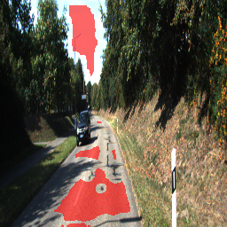

# Deep learning for autonomous systems
Advanced algorithms and architectures for deep learning with neural networks, implemented for educational purpose in coherence with course [TEK5040](https://www.uio.no/studier/emner/matnat/its/TEK5040/).

## Implemented Algorithms/Solutions

### U-Net for road segmentation

Semantic segmentation of optical images, in this case Roads using U-net CNN structure.


Results of U-net vs a simple CNN model:




Train the U-net: 
```bash
python train.py train_dir/u_net
```
